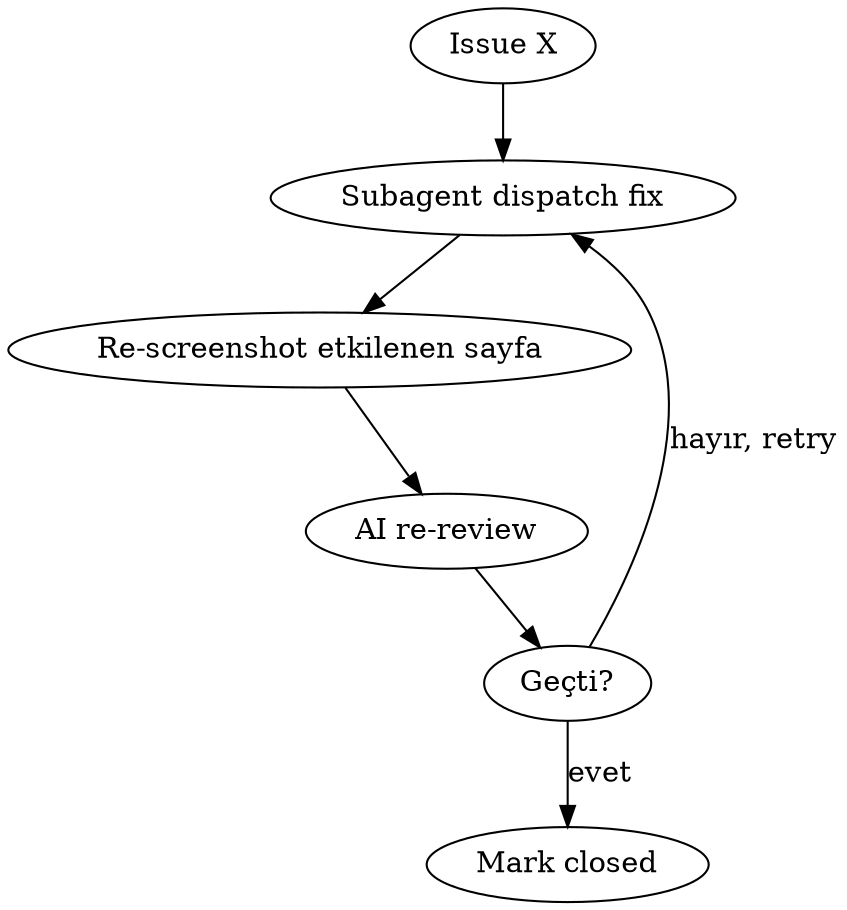

# Faz 14 — Screenshot QA Loop (Light + Dark Mode) Implementation Plan

> **For agentic workers:** REQUIRED SUB-SKILL: Use superpowers:subagent-driven-development. Steps use checkbox.

**Goal:** Tüm public + auth + admin sayfalarını Playwright ile mobile (375px) + desktop (1440px) viewport'larında, hem light hem dark tema için otomatik screenshot al. Claude Opus (multimodal) her ekranı görsel olarak incele: layout taşması, üst üste binme, kontrast yetersizliği, eksik element, mobil ezilme, dark mode uyumsuzluk. Bulunan issue'ları severity'ye göre triaj edip iteratif fix → re-screenshot → re-verify döngüsü ile mükemmeliyetçi pass yap.

**Architecture:**
- **Playwright** headless Chromium screenshot
- 4 boyut/sayfa: `desktop-light`, `desktop-dark`, `mobile-light`, `mobile-dark`
- Auth: admin sayfaları için seed admin (kullanıcı zaten admin rolü atadı) ile pre-login → cookie inject
- Theme: site `next-themes` kullanıyor; `localStorage.theme = 'light'|'dark'` set edip navigate
- Dynamic routes (`[id]`): script önce DB'den 1 sample id çekiyor, route template'lere yerleştiriyor
- Screenshots `screenshots/<route-slug>/<viewport>-<theme>.png` altında
- AI review: ben (Opus 4.7) batch batch okurum, issue listesi üretirim
- Fix loop: issue → subagent → re-screenshot ilgili sayfa → re-review → kapat veya retry

**Tech Stack:**
- `@playwright/test` (headless Chromium)
- `playwright-core` Chromium binary
- Mevcut: `pg` (sample id çekmek için), dev server

**Tahmini task: 9**

---

## Task 1: Playwright kurulumu + browser binary

**Files:**
- Modify: `package.json` (devDependency + npm script)
- Create: `.gitignore` entry'si: `screenshots/`

- [ ] **Step 1: Paket kur**

```powershell
npm install --save-dev @playwright/test
```

- [ ] **Step 2: Chromium binary indir (one-time, ~150MB)**

```powershell
npx playwright install chromium
```

⚠️ Bu indirme bir kez yapılır. CI/Production'da gerekmez — sadece lokal QA için.

- [ ] **Step 3: `.gitignore`'a ekle**

`.gitignore` dosyasının altına:

```
# Faz 14 — Screenshot QA outputs
screenshots/
playwright-report/
test-results/
```

- [ ] **Step 4: package.json npm script**

```json
"qa:screenshot": "tsx scripts/qa-screenshot.ts",
"qa:screenshot:one": "tsx scripts/qa-screenshot.ts"
```

(İkincisi belirli bir route için.)

- [ ] **Step 5: Build clean + commit**

```powershell
npm run build
git add package.json package-lock.json .gitignore
git commit -m "chore(deps): add playwright for screenshot QA"
```

---

## Task 2: Route inventory + sample id resolver

**Files:**
- Create: `scripts/qa/routes.ts`
- Create: `scripts/qa/resolve-ids.ts`

Hangi sayfa screenshot alınacak, hangi auth gerekli, hangi dynamic id'lerle.

- [ ] **Step 1: routes.ts**

```ts
// scripts/qa/routes.ts
export type RouteAuth = 'public' | 'user' | 'admin';

export interface RouteSpec {
  /** URL path; `[id]` placeholder DB'den resolve edilir. */
  path: string;
  /** Slug for output dir name. */
  slug: string;
  auth: RouteAuth;
  /** Hangi tablodan id alınacak (dynamic route ise). */
  idFrom?: 'products' | 'projects' | 'faqs' | 'categories' | 'quotes' | 'dealer_applications' | 'contact_messages' | 'profiles' | 'suppliers';
  /** Bu rota mobile'da farklı davranmıyorsa atla. */
  skipMobile?: boolean;
}

export const ROUTES: RouteSpec[] = [
  // Public
  { path: '/', slug: 'home', auth: 'public' },
  { path: '/magaza', slug: 'magaza-list', auth: 'public' },
  { path: '/magaza/[slug]', slug: 'magaza-detail', auth: 'public', idFrom: 'products' },
  { path: '/teklif', slug: 'teklif-hub', auth: 'public' },
  { path: '/teklif/al', slug: 'teklif-al', auth: 'public' },
  { path: '/teklif/ver', slug: 'teklif-ver', auth: 'public' },
  { path: '/galeri', slug: 'galeri-list', auth: 'public' },
  { path: '/galeri/[slug]', slug: 'galeri-detail', auth: 'public', idFrom: 'projects' },
  { path: '/hakkimizda', slug: 'hakkimizda', auth: 'public' },
  { path: '/iletisim', slug: 'iletisim', auth: 'public' },
  { path: '/sss', slug: 'sss', auth: 'public' },
  { path: '/ayarlar', slug: 'ayarlar', auth: 'public' },
  { path: '/kvkk', slug: 'kvkk', auth: 'public' },
  // Guest-only
  { path: '/giris', slug: 'giris', auth: 'public' },
  { path: '/kayit', slug: 'kayit', auth: 'public' },
  { path: '/sifremi-unuttum', slug: 'sifre-unuttum', auth: 'public' },
  // User
  { path: '/hesap', slug: 'hesap', auth: 'user' },
  { path: '/hesap/profil', slug: 'hesap-profil', auth: 'user' },
  { path: '/hesap/teklifler', slug: 'hesap-teklifler', auth: 'user' },
  { path: '/hesap/favoriler', slug: 'hesap-favoriler', auth: 'user' },
  { path: '/hesap/bildirimler', slug: 'hesap-bildirimler', auth: 'user' },
  { path: '/hesap/kvkk', slug: 'hesap-kvkk', auth: 'user' },
  { path: '/hesap/kvkk/sil', slug: 'hesap-kvkk-sil', auth: 'user' },
  { path: '/ayarlar/eposta', slug: 'ayarlar-eposta', auth: 'user' },
  // Admin
  { path: '/admin', slug: 'admin-dashboard', auth: 'admin' },
  { path: '/admin/teklifler', slug: 'admin-teklifler', auth: 'admin' },
  { path: '/admin/teklifler/[id]', slug: 'admin-teklif-detail', auth: 'admin', idFrom: 'quotes' },
  { path: '/admin/bayiler', slug: 'admin-bayiler', auth: 'admin' },
  { path: '/admin/bayiler/[id]', slug: 'admin-bayi-detail', auth: 'admin', idFrom: 'dealer_applications' },
  { path: '/admin/iletisim', slug: 'admin-iletisim', auth: 'admin' },
  { path: '/admin/iletisim/[id]', slug: 'admin-mesaj-detail', auth: 'admin', idFrom: 'contact_messages' },
  { path: '/admin/kullanicilar', slug: 'admin-kullanicilar', auth: 'admin' },
  { path: '/admin/urunler', slug: 'admin-urunler', auth: 'admin' },
  { path: '/admin/urunler/yeni', slug: 'admin-urun-yeni', auth: 'admin' },
  { path: '/admin/urunler/[id]', slug: 'admin-urun-edit', auth: 'admin', idFrom: 'products' },
  { path: '/admin/kategoriler', slug: 'admin-kategoriler', auth: 'admin' },
  { path: '/admin/kategoriler/yeni', slug: 'admin-kategori-yeni', auth: 'admin' },
  { path: '/admin/kategoriler/[id]', slug: 'admin-kategori-edit', auth: 'admin', idFrom: 'categories' },
  { path: '/admin/projeler', slug: 'admin-projeler', auth: 'admin' },
  { path: '/admin/projeler/yeni', slug: 'admin-proje-yeni', auth: 'admin' },
  { path: '/admin/projeler/[id]', slug: 'admin-proje-edit', auth: 'admin', idFrom: 'projects' },
  { path: '/admin/sss', slug: 'admin-sss', auth: 'admin' },
  { path: '/admin/sss/yeni', slug: 'admin-sss-yeni', auth: 'admin' },
  { path: '/admin/sss/[id]', slug: 'admin-sss-edit', auth: 'admin', idFrom: 'faqs' },
  { path: '/admin/tedarikciler', slug: 'admin-tedarikciler', auth: 'admin' },
  { path: '/admin/tedarikciler/yeni', slug: 'admin-tedarikci-yeni', auth: 'admin' },
  { path: '/admin/ai', slug: 'admin-ai', auth: 'admin' },
];
```

- [ ] **Step 2: resolve-ids.ts**

```ts
// scripts/qa/resolve-ids.ts
import { config as loadEnv } from 'dotenv';
import { Client } from 'pg';

loadEnv({ path: '.env.local' });

const TABLES = [
  'products',
  'projects',
  'faqs',
  'categories',
  'quotes',
  'dealer_applications',
  'contact_messages',
  'profiles',
  'suppliers',
] as const;

export type SampleTable = (typeof TABLES)[number];

export async function resolveSampleIds(): Promise<Record<SampleTable, string | null>> {
  const client = new Client({ connectionString: process.env.DATABASE_URL });
  await client.connect();
  const result: Record<string, string | null> = {};
  for (const table of TABLES) {
    // products/projects/faqs/categories use slug for public routes; rest use id
    const col = table === 'products' || table === 'projects' || table === 'faqs' || table === 'categories' ? 'slug' : 'id';
    try {
      const { rows } = await client.query(`select ${col} as v from public.${table} limit 1`);
      result[table] = (rows[0]?.v as string | undefined) ?? null;
    } catch {
      result[table] = null;
    }
  }
  await client.end();
  return result as Record<SampleTable, string | null>;
}

export function fillRoute(template: string, sampleIds: Record<SampleTable, string | null>, idFrom?: SampleTable): string | null {
  if (!template.includes('[')) return template;
  if (!idFrom) return null;
  const id = sampleIds[idFrom];
  if (!id) return null;
  return template.replace(/\[(slug|id)\]/, id);
}
```

⚠️ NOT: `products/projects/faqs/categories` için slug kullanırız (public URL'lerde slug var); `quotes/dealer_applications/.../suppliers/profiles` için id (admin URL'leri).

Wait — admin için `[id]` template. `products` adminde de `[id]` ile kullanılıyor (`/admin/urunler/[id]`). Buradan slug yerine id alıp yerleştirmek gerekiyor.

Düzeltme: `slug` mu `id` mi seçimi route'a göre, table'a göre değil. routes.ts'e `idType: 'slug' | 'id'` ekle, default 'id'. Public'lerde slug, admin'lerde id.

```ts
// routes.ts'e ekle:
export interface RouteSpec {
  // ... existing
  idType?: 'slug' | 'id';  // default 'id'
}

// public dynamic routes use slug:
{ path: '/magaza/[slug]', slug: 'magaza-detail', auth: 'public', idFrom: 'products', idType: 'slug' },
{ path: '/galeri/[slug]', slug: 'galeri-detail', auth: 'public', idFrom: 'projects', idType: 'slug' },

// admin dynamic routes use id (default):
{ path: '/admin/urunler/[id]', slug: 'admin-urun-edit', auth: 'admin', idFrom: 'products' },
// ... vs
```

`resolveSampleIds()` her iki tip için map dönsün:

```ts
export interface SampleIds {
  productsSlug: string | null;
  productsId: string | null;
  projectsSlug: string | null;
  projectsId: string | null;
  faqsId: string | null;
  categoriesId: string | null;
  quotesId: string | null;
  dealersId: string | null;
  contactsId: string | null;
  profilesId: string | null;
  suppliersId: string | null;
}
```

`fillRoute` artık `(template, ids, idFrom, idType)` alır ve doğru kolonu seçer.

- [ ] **Step 3: Build clean + commit**

```powershell
git add scripts/qa/routes.ts scripts/qa/resolve-ids.ts
git commit -m "feat(qa): add route inventory + sample-id resolver for screenshot QA"
```

---

## Task 3: Playwright auth + theme setup

**Files:**
- Create: `scripts/qa/auth.ts`
- Create: `scripts/qa/theme.ts`

- [ ] **Step 1: auth.ts**

```ts
// scripts/qa/auth.ts
import type { Page, BrowserContext } from '@playwright/test';

export interface AuthCreds {
  email: string;
  password: string;
}

const BASE = process.env.NEXT_PUBLIC_SITE_URL ?? 'http://localhost:3000';

export async function loginAdmin(context: BrowserContext, creds: AuthCreds): Promise<void> {
  const page = await context.newPage();
  await page.goto(`${BASE}/giris`);
  await page.fill('input[type="email"]', creds.email);
  await page.fill('input[type="password"]', creds.password);
  await page.click('button[type="submit"]');
  // Wait for redirect away from /giris
  await page.waitForURL((url) => !url.pathname.startsWith('/giris'), { timeout: 10_000 });
  await page.close();
}
```

⚠️ Kullanıcı `.env.local`'a test admin credentials eklemeli (veya kullanılmakta olan admin hesabı). `QA_ADMIN_EMAIL`, `QA_ADMIN_PASSWORD`.

- [ ] **Step 2: theme.ts**

```ts
// scripts/qa/theme.ts
import type { BrowserContext, Page } from '@playwright/test';

export type Theme = 'light' | 'dark';

const BASE = process.env.NEXT_PUBLIC_SITE_URL ?? 'http://localhost:3000';

export async function setTheme(context: BrowserContext, theme: Theme): Promise<void> {
  // next-themes uses localStorage 'theme' key
  await context.addInitScript(({ theme }) => {
    try {
      localStorage.setItem('theme', theme);
      document.documentElement.classList.remove('light', 'dark');
      document.documentElement.classList.add(theme);
    } catch {}
  }, { theme });
}

export async function navigateWithTheme(page: Page, path: string, theme: Theme): Promise<void> {
  // Go to page; init script set localStorage; wait for hydration; theme should be applied
  await page.goto(`${BASE}${path}`, { waitUntil: 'networkidle', timeout: 15_000 });
  // Re-apply class in case next-themes overrode it
  await page.evaluate((t) => {
    localStorage.setItem('theme', t);
    document.documentElement.classList.remove('light', 'dark');
    document.documentElement.classList.add(t);
  }, theme);
  // Brief settle for re-render
  await page.waitForTimeout(300);
}
```

- [ ] **Step 3: Commit**

```powershell
git add scripts/qa/auth.ts scripts/qa/theme.ts
git commit -m "feat(qa): add auth + theme helpers for Playwright"
```

---

## Task 4: Screenshot script

**Files:**
- Create: `scripts/qa-screenshot.ts`
- Modify: `.env.example` (QA_ADMIN_EMAIL, QA_ADMIN_PASSWORD)

Tek script, tüm flow'u çalıştırır:
1. Sample id'leri DB'den çek
2. Browser başlat (3 context: public/user/admin)
3. Her route × viewport × theme için screenshot al
4. Output progress + summary

- [ ] **Step 1: qa-screenshot.ts**

```ts
import { config as loadEnv } from 'dotenv';
import { chromium, type Browser, type BrowserContext } from '@playwright/test';
import { mkdir } from 'node:fs/promises';
import { join } from 'node:path';
import { ROUTES } from './qa/routes';
import { resolveSampleIds, fillRoute } from './qa/resolve-ids';
import { loginAdmin } from './qa/auth';
import { setTheme, navigateWithTheme, type Theme } from './qa/theme';

loadEnv({ path: '.env.local' });

const VIEWPORTS = [
  { name: 'desktop', width: 1440, height: 900 },
  { name: 'mobile', width: 375, height: 812 },
] as const;

const THEMES: Theme[] = ['light', 'dark'];

const OUT_DIR = join(process.cwd(), 'screenshots');

async function main() {
  // Single-route mode: npm run qa:screenshot -- <slug>
  const onlySlug = process.argv[2];

  console.log('🔍 Sample id\'leri çekiliyor...');
  const ids = await resolveSampleIds();
  console.log('   ', ids);

  console.log('🚀 Playwright Chromium başlatılıyor...');
  const browser: Browser = await chromium.launch({ headless: true });

  const adminEmail = process.env.QA_ADMIN_EMAIL;
  const adminPassword = process.env.QA_ADMIN_PASSWORD;

  // 3 contexts: public (no auth), user (TBD - admin user works as user too), admin (logged in)
  const publicCtx = await browser.newContext();
  const adminCtx = await browser.newContext();

  if (adminEmail && adminPassword) {
    console.log(`🔑 Admin olarak giriş yapılıyor (${adminEmail})...`);
    await loginAdmin(adminCtx, { email: adminEmail, password: adminPassword });
  } else {
    console.warn('⚠️ QA_ADMIN_EMAIL/PASSWORD yok — admin sayfaları atlanacak');
  }

  let captured = 0;
  let skipped = 0;
  const failures: string[] = [];

  for (const route of ROUTES) {
    if (onlySlug && route.slug !== onlySlug) continue;

    const filledPath = fillRoute(route.path, ids, route.idFrom, route.idType ?? 'id');
    if (!filledPath) {
      skipped++;
      console.log(`⏭️  ${route.slug}: id resolved to null, atlanıyor`);
      continue;
    }

    const ctx: BrowserContext =
      route.auth === 'admin' || route.auth === 'user' ? adminCtx : publicCtx;

    if ((route.auth === 'admin' || route.auth === 'user') && (!adminEmail || !adminPassword)) {
      skipped++;
      continue;
    }

    const dir = join(OUT_DIR, route.slug);
    await mkdir(dir, { recursive: true });

    for (const viewport of VIEWPORTS) {
      for (const theme of THEMES) {
        const page = await ctx.newPage();
        await page.setViewportSize({ width: viewport.width, height: viewport.height });
        await setTheme(ctx, theme);
        try {
          await navigateWithTheme(page, filledPath, theme);
          const file = join(dir, `${viewport.name}-${theme}.png`);
          await page.screenshot({ path: file, fullPage: true });
          captured++;
          process.stdout.write('.');
        } catch (e) {
          failures.push(`${route.slug} ${viewport.name}-${theme}: ${e instanceof Error ? e.message : String(e)}`);
          process.stdout.write('x');
        }
        await page.close();
      }
    }
    console.log(` ${route.slug}`);
  }

  await browser.close();

  console.log(`\n✅ Tamamlandı: ${captured} screenshot, ${skipped} atlandı, ${failures.length} hata`);
  if (failures.length > 0) {
    console.log('Hatalar:');
    for (const f of failures) console.log(`  - ${f}`);
  }
}

main().catch((e) => {
  console.error(e);
  process.exit(1);
});
```

- [ ] **Step 2: .env.example güncelle**

```
# QA admin credentials (Faz 14 screenshot loop için)
QA_ADMIN_EMAIL=admin@example.com
QA_ADMIN_PASSWORD=your-password
```

- [ ] **Step 3: Build clean + commit**

```powershell
git add scripts/qa-screenshot.ts .env.example
git commit -m "feat(qa): add Playwright screenshot script"
```

---

## Task 5: First pass — capture all screenshots

⚠️ **Kullanıcı eylemi gerekli:**

- [ ] **Step 1: .env.local'a admin creds ekle**

```
QA_ADMIN_EMAIL=m4likiletisim@gmail.com
QA_ADMIN_PASSWORD=<sizin admin şifreniz>
```

- [ ] **Step 2: Dev server çalışır olduğundan emin ol**

```powershell
npm run dev    # ayrı terminalde
```

- [ ] **Step 3: Playwright browser binary kur (one-time)**

```powershell
npx playwright install chromium
```

- [ ] **Step 4: Tüm screenshot'ları al**

```powershell
npm run qa:screenshot
```

Tahmini süre: 30-50 sayfa × 4 görüntü = 120-200 screenshot, ~3-5 dakika.

- [ ] **Step 5: Screenshots dizinini doğrula**

`screenshots/<slug>/<viewport>-<theme>.png` yapısı. Her sayfa için 4 dosya.

---

## Task 6: AI review batch 1 — Public sayfalar

(Bu task script ile değil, Claude Opus tarafından yapılacak.)

- [ ] **Step 1: Public sayfaların screenshot'larını oku**

`screenshots/{home,magaza-list,magaza-detail,teklif-*,galeri-*,hakkimizda,iletisim,sss,ayarlar,kvkk,giris,kayit,sifre-unuttum}` altındaki tüm `.png` dosyalarını Read tool ile yükle.

- [ ] **Step 2: Issue listesi üret**

Her sayfa için 4 görüntü görsel olarak incele:
- **Layout:** taşma, scroll bar, içerik kesilmesi
- **Çakışma:** üst üste binen elementler
- **Kontrast:** dark mode'da düşük kontrast text, light mode'da çok soluk renkler
- **Mobil:** ezilmiş button, üst üste binmiş form alan, gizlenmiş element
- **Tema tutarsızlığı:** dark mode'da kalan beyaz arka plan, light mode'da kalan koyu element
- **Eksik element:** form alanı boşta, button etiketi yok, ikon eksik

Her issue: `severity: critical|major|minor`, `viewport`, `theme`, `description`, `suggested_fix`.

Output: `docs/qa/screenshot-issues-public.md`

- [ ] **Step 3: Commit issue listesi**

```powershell
git add docs/qa/screenshot-issues-public.md
git commit -m "docs(qa): public pages screenshot review — N issues"
```

---

## Task 7: AI review batch 2 — Auth + Admin sayfalar

(Aynı yapı, farklı kapsam.)

- [ ] Screenshot'ları oku → issue listesi → commit:
- `screenshots/hesap-*/`, `screenshots/ayarlar-eposta/`, `screenshots/eposta-cik/`
- `screenshots/admin-*/`

Output: `docs/qa/screenshot-issues-auth-admin.md`

```powershell
git commit -m "docs(qa): auth + admin pages screenshot review — N issues"
```

---

## Task 8: Fix loop

Triaj edilmiş major + critical issues için:

- [ ] **Her issue için döngü:**



Tek sayfa için screenshot:
```powershell
npm run qa:screenshot -- admin-urun-yeni
```

(Script'in `process.argv[2]` filter desteği var.)

- [ ] **Minor issues:** backlog'a ekle (`docs/qa/screenshot-issues-backlog.md`), düzeltme zorunlu değil.

- [ ] **Her major fix sonrası commit:**

```powershell
git commit -m "fix(qa): {sayfa-slug} {issue-summary}"
```

---

## Task 9: Final verification + completion report

**Files:**
- Create: `docs/superpowers/plans/2026-05-07-faz-14-completion.md`

- [ ] **Step 1: Final screenshot pass (opsiyonel)**

Tüm fix'ler kapandıktan sonra son bir tam screenshot çek, spot-check yap.

- [ ] **Step 2: Test + build clean**

```powershell
npm test -- --run
npm run build
```

231/231 (yeni test eklenmedi) + build temiz.

- [ ] **Step 3: Completion raporu**

Standart format:
- Toplam screenshot sayısı (fix öncesi + sonrası)
- Issue triajı (critical/major/minor — fixed/deferred)
- Etkilenen sayfa listesi
- Light/dark mode'da herşeyin işlevsel olduğunun teyidi
- Bilinen sınırlamalar

- [ ] **Step 4: Commit + push**

```powershell
git add docs/superpowers/plans/2026-05-07-faz-14-completion.md
git commit -m "docs: Faz 14 completion report (screenshot QA pass)"
git push origin master
```

---

## Self-Review

- [ ] Playwright `.gitignore`'da, screenshot'lar repo'ya gitmiyor
- [ ] resolveSampleIds boş table durumunu graceful handle ediyor (route atlanıyor)
- [ ] Auth helper kullanıcı creds yoksa graceful skip
- [ ] Theme set localStorage + className override (next-themes default'unu beat etmek için)
- [ ] Single-route mode: `npm run qa:screenshot -- <slug>` çalışıyor
- [ ] Issue review batch'lere bölündü (token verimliliği)
- [ ] Fix loop deterministik: re-screenshot → re-review

## Kapsam Dışı

- **Cross-browser** (Firefox, Safari) — sadece Chromium
- **Performance audit** (Lighthouse, Core Web Vitals) — ayrı faz
- **A11y audit** (axe-core, WCAG) — ayrı faz; biz sadece görsel issue'lara odaklanıyoruz
- **Visual regression CI** — bu pass tek seferlik, regression için ayrı altyapı gerekli
- **Internationalization** — sadece tr-TR
- **Empty state vs filled state** — DB'de varsa filled gösterilir; empty state için seed/teardown gerekirdi (gelecek)
- **Form interaction tests** — sadece statik render; click/scroll davranışı test edilmiyor
- **Hover/focus state'leri** — screenshot statik, hover yakalanmıyor

## Riskler

- **Auth flow değişirse:** loginAdmin selector'ları (`input[type="email"]`) güncellemek lazım
- **next-themes class override timing:** bazı sayfalarda hydration sonrası tema değişmiyor → 300ms bekleme yetmezse arttırılır
- **Dynamic content drift:** her çalıştırmada DB içeriği farklı olabilir → screenshot'lar tutarsız. Acceptable for QA pass; regression için seed gerekli
- **Token maliyeti:** 120-200 screenshot okumak Opus için çok bağlam tüketir. Batch'leme + selective skip (`looks fine`) ile yönetilir
- **Long-running:** Playwright + AI review toplam 30-60 dk olabilir. Background'da çalışmıyor, oturum boyunca aktif kalmalı
